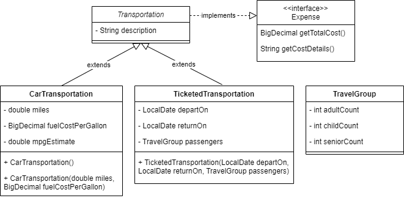
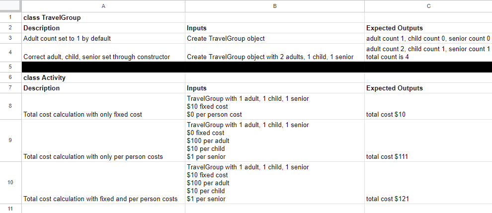

# Module one final project

There are three options for this final project:

1. Implement the Catalog application described later in this document.
2. Create and implement your own application.
3. If you completed a custom application for the mid-module project, you can extend and build upon it for the final project.

The Catalog application is a guided project with clear requirements describing the work you must do. However, since this application's design and instructions are part of the program curriculum, you can't host it publicly or use it directly in your software portfolio.

## Design requirements

* All applications must include project design documents, charts, and/or diagrams.
  * You must submit required design documents in the `design` folder at the root of this project.
  * Recommended design assets are optional.

### Required

* [**Custom project only**] Documentation of functional requirements to act as the application's Minimum Viable Product ([MVP](https://en.wikipedia.org/wiki/Minimum_viable_product)).
  * A functional requirement describes what the application can do or provide from a user's perspective.
  * Capture functional requirements as a *[user story](https://en.wikipedia.org/wiki/User_story)*. Examples:
    * "As an application user, I can create a vacation by entering the vacation name, departure date, and return date."
    * "As an application user, I can add or remove activities for an existing vacation."
    * "As an application user, I can view an expense report detailing all the costs for a created vacation."
* Class and Interface summaries
  * Class/Interface name
  * List instance variables (also called properties or attributes)
  * List constructors and methods
    * Include name, input parameters, and return type
    * Getters, setters, and generated methods like `toString()` aren't required
    * Code in constructor or method bodies aren't required
    * Listing thrown or caught exceptions aren't required
  * Indicate any class or interface relationships
    * Superclasses and subclasses
    * Interfaces implemented by a class
* Create a test plan describing the following:
  * Unit test cases
    * Class name
    * Description of test case
    * Inputs and expected outputs
  * Any gaps in test coverage

Example class summary generated using [drawio](https://draw.io):



Example test plan generated using Google Sheets:



### Recommended

* High level flow chart or state machine diagram
  * Describe *how* the user transitions to different parts of the application at a high level
  * This typically doesn't include algorithms or code implementation details

## Creating or extending your own application

If you decide to create a new application or extend your existing mid-module project, **you must confirm your application proposal with your instructor.**

### Custom application requirements

At a minimum, your application must meet the following minimum requirements:

* Have a clear purpose, function, or utility
    * If not sure, please confirm the project your with instructor
* Include a way for a user to interact with the application
* Use at least 2 dataset files containing entities with attributes/qualities
    * Example 1: Dataset of exercisers and workouts
      * Each workout containing: name, duration, number of exercises, intensity level, etc.
    * Example 2: Dataset of listeners, playlists, and songs
      * Each song containing: name, artist, release date, genre, etc.
    * Example 3: Dataset of owners and pets
      * Each pet containing: animal type, name, age, weight, is a rescue, is potty trained, etc.
* Read the dataset files into the application using File I/O
* Use classes to model each entity in the dataset files
    * Create instances of these classes to represent the dataset entities read from the files
    * All classes must practice encapsulation
* Incorporate at least one of the following data structures: Array, List, Map, Stack, Queue, or Set
* Include a feature that writes data to a file
    * Example 1: Creating a log file of user transactions
    * Example 2: Updating a user's order
* Contain at least one interface with at least one abstract method
    * At least two classes must implement this interface
* Use at least one custom exception
    * You must throw and catch the custom exception purposefully in the application
* Implement the unit test cases from the test plan created in the [Design Requirements](#design-requirements) section
    * Add the test classes to the `src/test` directory

### Datasets

Below are sites that contain free datasets you can use for your application:
* [https://kaggle.com/datasets](https://kaggle.com/datasets)
* [https://ieee-dataport.org](https://ieee-dataport.org)

## Catalog application

This application is a catalog of items that application users can lend to each other. The design builds off the previous project where you made an application that imports data on books and provides the ability to search on that data. Instead of reading the data from a hard-coded array, you'll read the data from text files. The dataset now also includes movies and tools. The data is in the `resources` folder in multiple files.

The [Requirements](#catalog-application-requirements) section later in this document describes the data format.

### Dataset files

You can find the dataset files for this application in the `src/main/resources/` directory. There are two files:

* `members.dat` - Read this file first to determine the application users and the filenames for each user's items
* `items-*.dat` - These files describe the items a particular user has available

Each member contains the following data:

* First name
* Last name

There are 3 distinct kinds of items with the following data:

* Book
  * id
  * Title
  * Author
  * Publish date
* Movie
  * id
  * Title
  * Director
  * Release date
* Tool
  * id
  * Type
  * Manufacturer
  * Count

The `id` for each item must be dynamically assigned when the item is initially read into the application.

Use the code `UUID.randomUUID().toString()` to generate a **universally unique identifier**—or UUID—and assign it to the `id` field.
* Note: this is a common technique for creating a unique ID in code. You might also hear this called a *globally unique identifier* or GUID.

### Catalog application requirements

You must complete the following functional requirements:

1. As an application user, I can view the full catalog, which contains every catalog user, the items they own, and each item's properties.
   1. A list of item properties is in the [Dataset Files](#dataset-files) section.
2. As an application user, I can enter the name of a specific catalog user, view all the items they own, and each item's properties.
   1. The search must match a catalog user's name exactly with no partial matches.
   2. The search must be case-sensitive.
   3. Return an error message if the specified user doesn't exist.
3. As an application user, I can do a search for an item by **item name** and view all the catalog users and their items that match the search term.
   1. Item name refers to either the book title, movie title, or tool type for the corresponding item.
   2. The search must allow partial matches where the search term either partially or fully matches the item name.
   3. The search must be case-insensitive.
4. As an application user, I can do a search for an item by **item creator** and view all the catalog users and their items that match the search term.
   1. Item creator refers to either the book author, movie director, or tool manufacturer for the corresponding item.
   2. The search must allow partial matches where the search term either partially or fully matches the creator name.
   3. The search must be case-insensitive.
5. As an application user, I can do a search for an item by **year** and view all the catalog users and their items that match the search year.
    1. Item year refers to either a book publish date or movie release date. Tool items never appear in these search results.
    2. The search must only fully match the year.
6. As an application creator, if a search returns no results, I must display the message `--No matching items--`
7. As an application creator, I must be able to handle the following in the member and item dataset files:
   1. Items appearing in any order (for example, a book listed between two movies)
   2. Empty lines
   3. Lines that have too many or too few fields
   4. An item type that isn't a book, movie, or tool
8. As an application creator, I can view a log of all the books, movies, and tools loaded when the application starts.
   1. Store the logs in the `src/main/resources/logs` directory
   2. Create a log for each type of item
   3. Log file names must include the type of item as well as the date created
   4. Log item entries must contain the item properties as well as the object's creation date and time
   5. Log files must not contain duplicate item entries

Log file examples
```
logs/movie-2024-09-20.log
...
Movie created at 2024-09-08 16:32:25.444917200
* Jurassic Park
- Directed by: Steven Spielberg
- Released: 1993-06-11
- Id: f1742e2f-ab0c-4d4f-8032-dd3c9cf6b94e
Movie created at 2024-09-08 16:32:25.472346500
* The Hitchhiker's Guide to the Galaxy
 - Directed by: Garth Jennings
 - Released: 2005-04-28
 - Id: d8f2d8cd-2ae7-4e03-865d-1095d93f2a0c
...
```

```
logs/book-2024-09-20.log
...
Book created at 2024-09-08 16:32:25.437747300
* Foundation
 - Written by: Isaac Asimov
 - Published: 1951-08-30
 - Id: 526e0e87-9898-4514-88d6-503e900b835a
Book created at 2024-09-08 16:32:25.442568200
* The Hunger Games
 - Written by: Suzanne Collins
 - Published: 2008-09-14
 - Id: 7c0426ac-2749-4c1c-b4b0-4c8eeabe37f0
...
```

```
logs/tool-2024-09-20.log
...
Tool created at 2024-09-08 16:32:25.429542900
* socket wrench
 - Manufactured by: Craftsman
 - Count: 1
 - Id: 1e4be186-0b64-42ce-9062-b4f565e09875
Tool created at 2024-09-08 16:32:25.436748700
* socket wrench
 - Manufactured by: DeWalt
 - Count: 2
 - Id: 2d3e75e9-2e3d-4ccb-a8ca-f654f84638a6
...
```

## Hints

### Data Parsing

You may use the following constants when parsing the member and item data files:

```java
private static final String FIELD_DELIMITER = "\\|";
private static final String FILE_BASE_PATH = "src/main/resources/";
```

### Classes

The `toString()` method can be used to print a description of a model class, for instance:
```java
@Override
public String toString() {
    return "* " + title + System.lineSeparator()
            + " - Written by: " + author + System.lineSeparator()
            + " - Published: " + publishDate + System.lineSeparator()
            + " - Id: " + id;
}
```
