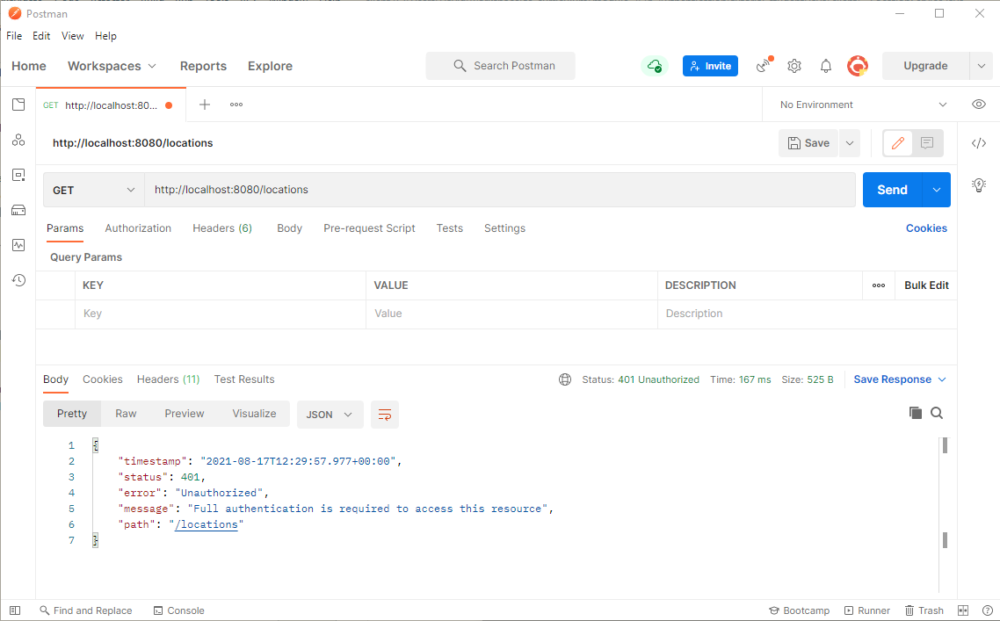
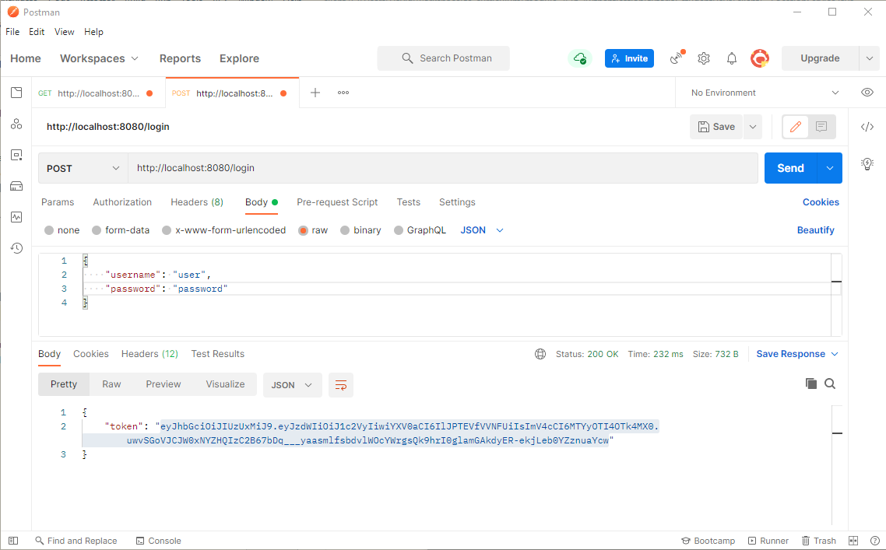
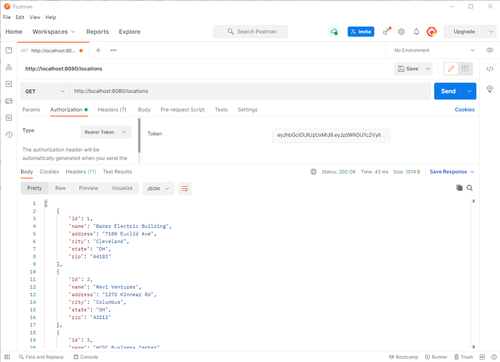

# Authentication tutorial

In this tutorial, you'll continue working on an application that uses meetup locations as the data model. You'll add the ability to log in to the client application and send the authentication token with any request.

## Step One: Open projects in IntelliJ and explore starting code

Before you begin, open both the `client` and `server` projects starter code in separate instances of IntelliJ. Review both projects.

### Client

The client application provides options to use all API endpoints provided by the server application, including login:

```
----Meetup Locations Menu----
1: List Locations
2: Show Location Details
3: Add a Location
4: Update a Location
5: Delete a Location
6: Login
0: Exit
```

Take a moment to examine the code that makes this login feature work. It starts in `App.java` with `handleLogin()`:

```java
private void handleLogin() {
    String username = consoleService.promptForString("Username: ");
    String password = consoleService.promptForString("Password: ");
    String token = authenticationService.login(username, password);
    if (token != null) {
        locationService.setAuthToken(token);
    } else {
        consoleService.printErrorMessage();
    }
}
```

If you successfully log in, you receive an authentication token. You take that token and pass it to the location service which uses it when accessing any API endpoint that requires authentication.

### Server

The server application might look familiar to you as it picks up where you left off in the previous tutorial. There's a new package called `security` that contains the code needed to implement authentication.

## Step Two: Run the applications

Now that you've set up your projects in IntelliJ and reviewed the starting code, run both of them to verify that they start up as expected. It's best to make sure the applications run before adding anything new.

## Step Three: Test the REST API in Postman

After starting the server application, you'll need to test the REST API in Postman before writing any client code. Open Postman and try to get a list of locations by visiting http://localhost:8080/locations. This and every request mapping in the `LocationController` returns a `401 Unauthorized` response.



Before sending any requests to the API, you need to log in and then use the authentication token that's sent back to you in any subsequent requests. Start by sending a `POST` request to `/login` with a username and password. There's a user in the system with a username of `user` and a password of `password`.



> Note: If you send a bad username and password, what happens?

The response is a JSON key-value pair where the key is `token`. You want to copy everything inside the double quotes because this is your authentication token. Now you can go back to the `GET` locations request that failed.

Under "Authorization", select the type `Bearer Token` and paste your token into the token field. This time, you're authenticated and receive a list of locations.



## Step Four: List all locations

Now that you've tested the API using Postman, you likely already know what you need to do in the client. You'll need to log in using the client application, store the authentication token, and then pass that token in an authorization header each time you make a call to the API.

Start by running the client application and selecting option 1 to list all of the locations. As expected, it doesn't work. If you check the log, you'll see the client received a `401 Unauthorized` response, like you did in Postman prior to including the token.

### Location service

Open `services/LocationService.java` and locate the `getAll()` method. To pass the authentication token, you need to call the `header()` method when setting up the request. This method takes 2 parameters:

1. The header name, `Authorization`
2. The header value, `Bearer ` + authToken. Example: `Bearer eyJhbGciOiJIU...`

The `header()` method sets a header on the request and is therefore placed in the method call chain before the `retrieve()` method:

```java
public Location[] getAll() {

    Location[] locations = null;
    try {
        locations = restClient.get()
                .header("Authorization", "Bearer " + authToken)
                .retrieve()
                .body(Location[].class);

    } catch (RestClientResponseException | ResourceAccessException e) {
        BasicLogger.log(e.getMessage());
    }
    return locations;
}
```

Run the client application, log in, and then try to list all of the locations.

## Step Five: Get a single location

If you try to get the details for a single location, you'll receive the same `401 Unauthorized` response. In the `LocationService` class, find the `getOne()` method. The changes you need to make here are similar to the ones you made for the `getAll()` method. Try to update this method on your own before looking at the following answer:

```java
public Location getOne(int id) {

    Location location = null;
    try {
        location = restClient.get()
                .uri("/" + id)
                .header("Authorization", "Bearer " + authToken)
                .retrieve()
                .body(Location.class);

    } catch (RestClientResponseException | ResourceAccessException e) {
        BasicLogger.log(e.getMessage());
    }
    return location;
}
```

## Step Six: Create, update, and delete location

The `add()`, `update()`, and `delete()` methods are also very similar. All that's needed is to add the `header()` method before the `retrieve()` method in the `RestClient` call chain. Try to modify these methods on your own before looking at the following answer:

```java
// Add location
returnedLocation = restClient.post()
        .header("Authorization", "Bearer " + authToken)
        .contentType(MediaType.APPLICATION_JSON)
        .body(newLocation)
        .retrieve()
        .body(Location.class);

// Update location
restClient.put()
        .uri("/" + updatedLocation.getId())
        .header("Authorization", "Bearer " + authToken)
        .contentType(MediaType.APPLICATION_JSON)
        .body(updatedLocation)
        .retrieve()
        .toBodilessEntity();

// Delete location
restClient.delete()
        .uri("/" + id)
        .header("Authorization", "Bearer " + authToken)
        .retrieve()
        .toBodilessEntity();
```

If you run the application, you can now create, update, and delete a location.

## Step Seven: Setting default headers

The code for the last few steps seemed very similar; for each request you added an `Authorization` header with the JWT token. If you know that the same header needs to be sent for each request you can set a default header on the `RestClient` object:

```java
this.restClient = RestClient.builder()
        .baseUrl(API_BASE_URL)
        .defaultHeader("Authorization", "Bearer " + authToken)
        .build();
```

This means for every request you won't need the `header()` method because it'll be sent by default by the `RestClient` object.

## Summary

In this tutorial, you learned:

- How to test a secure API using Postman.
- How to send an authentication token using `RestClient`.
- How to use the `RestClient` `header()` methods for `GET`, `POST`, `PUT`, and `DELETE`.
