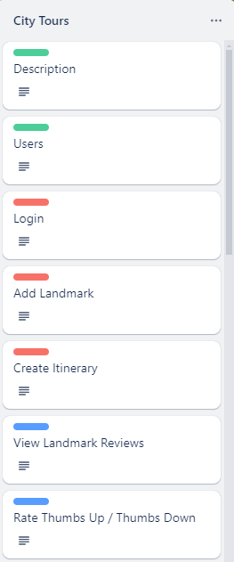
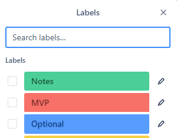

# Module two final project

There are four options for this final project:

1. Create and implement your own application.
1. Implement an application for a [Trello board project](https://trello.com/b/SHSRQCza/te-module2-final-projects).
1. If you completed a custom application for the mid-module project, you can extend and build upon it for the final project.

If you decide to create your own application or extend upon your mid-module project, **you must confirm your application proposal with your instructor.**

## Design Requirements

All applications must include project design documents, charts, and/or diagrams.
 * Place the database ERD in the `database` folder.
 * Submit all other required design documents in the `design` folder at the root of this project.
 * Recommended design documents are optional.

### Required

* [**Custom project only**] Documentation of functional requirements to act as the application's Minimum Viable Product ([MVP](https://en.wikipedia.org/wiki/Minimum_viable_product)).
  * A functional requirement describes what the application can do or provide from a user's perspective.
  * Capture functional requirements as a *[user story](https://en.wikipedia.org/wiki/User_story)*. Examples:
    * "As an unauthenticated user, I can review a list of products for sale."
    * "As an authenticated user, I can clear my cart, removing all items from the cart."
  * At least one functional requirement must require authentication
* Database ERD diagram which includes:
  * At least one table in addition to the provided users table
  * At least one many-to-many OR one-to-many relationship between tables
  * All columns, relationships, and constraints for each table
* API endpoint design document which includes a list of all endpoints:
  * List HTTP method and URL
  * Indicate any path variables or query parameters
  * Indicate if the endpoint requires authentication and/or authorization roles
  * Success and error status codes
  * Any JSON request and/or response body schemas

Below is an example of API endpoint design table:

| Endpoint               | Method | Query Parameters                        | Description                   | Success | Error    | Authentication   |
|:-----------------------|:------:|:----------------------------------------|:------------------------------|:-------:|:---------|:-----------------|
| /api/reservations      |  GET   | dateto, optional datefrom, optional | Get all reservations          |   200   | 400      | None             |
| /api/reservations      |  POST  | None                                    | Create a new reservation      |   201   | 400, 422 | Required         |
| /api/reservations/{id} |  GET   | None                                    | Get a specific reservation    |   200   | 404      | Creator or ADMIN |
| /api/reservations/{id} |  PUT   | None                                    | Update a specific reservation |   200   | 404, 409 | Creator or ADMIN |
| /api/reservations/{id} | DELETE | None                                    | Delete a specific reservation |   204   | 404      | ADMIN            |

### Recommended

* Class summaries
  * Instance variables
  * public methods
  * Inheritance or interface relationships
  * Examples:
    * DAO interfaces with method descriptions
    * Model classes
      * DTO @valid checks
    * Service classes
* Flow charts or [Sequence diagrams](https://en.wikipedia.org/wiki/Sequence_diagram)
  * Summarize end-to-end HTTP request to HTTP response for API endpoints
* Database Integration Test Plan
  * Happy Path test cases
  * Corner cases
  * Success criteria
  * Mock users and/or mock test data

## Project Requirements

At a minimum, your application must meet the following minimum requirements:

* Have a clear purpose, function, or utility.
* Document at least five functional requirements with at least one requiring an authenticated user.
  * If choosing a Trello project, complete all, or at least five, of the MVP (red) User Stories. **Make sure to confirm your 5 functional requirements with your instructor.** 
  * The provided login and registration flow **can not** be used as one of the five functional requirements.
  * Requirements utilizing the methods from the provided `userDao` class **can not** be used as one of the five minimum functional requirements.
* Use Spring Boot and Postgres to create a backend web service.
* Implement a REST API with appropriate, authenticated endpoints.
  * At least one endpoint must require *meaningful* authentication.
* Use the DAO pattern to access the database.
* Provide a SQL script to create database tables and any mock data.
* Use an external API in a *meaningful* way.
  * The following are sites which have link to free, public web APIs
    * [Public APIs](https://github.com/public-apis/public-apis)
    * [rapidapi](https://rapidapi.com/collection/list-of-free-apis)

## Creating an application from a Trello Board Project

[Trello Board projects](https://trello.com/b/SHSRQCza/te-module2-final-projects) contain *[user story](https://en.wikipedia.org/wiki/User_story)* cards, which act as the project's functional requirements.
Each card in a Trello Board is color coded with a green, red, or blue label.
 * Green label - Information only, no work needs to be done.
 * Red label - A user story that is a part of the minimum requirements to complete the project. These user stories must all be implemented to achieve a Minimum Viable Product ([MVP](https://en.wikipedia.org/wiki/Minimum_viable_product)).
 * Blue or Orange label - A user story that is optional and should only be completed *after* completing all the MVP (red) user stories.

Below is an example from the City Tours project:

 

## Database setup

To run the application, you must first create the `m2_final_project` database. Then run the `database/m2_final_project.sql` script to create the user table with some test users.

> Note: The script creates two users for testing, `user` and `admin`, which both have the password: `password`.

## Running the starter code

Use the code in this project as the starter code for your project.
After setting up the database, run the application from the Application class. There should be no errors.

The starter code implements the two functional requirements below:
1. As an unauthenticated user, I need to be able to register myself with a username and password.
1. As an unauthenticated user, I need to be able to log in using my registered username and password.

The API endpoints for these two requirements are in `controller/AuthenticationController.java`: 
1. POST `/register`
1. POST `/login`

To test these two endpoints, import the `postman/M2-Final_Project.postman_collection.json` into Postman as a collection.
Open the Login and Register requests and test they work.

## API Documentation

While your application is running you can view the documentation for your REST API here:
[http://www.localhost:8080/swagger-ui/index.html](http://www.localhost:8080/swagger-ui/index.html)

If you want to make changes to the documentation the source code is located in `apidoc/ApiDocConfig.java`  